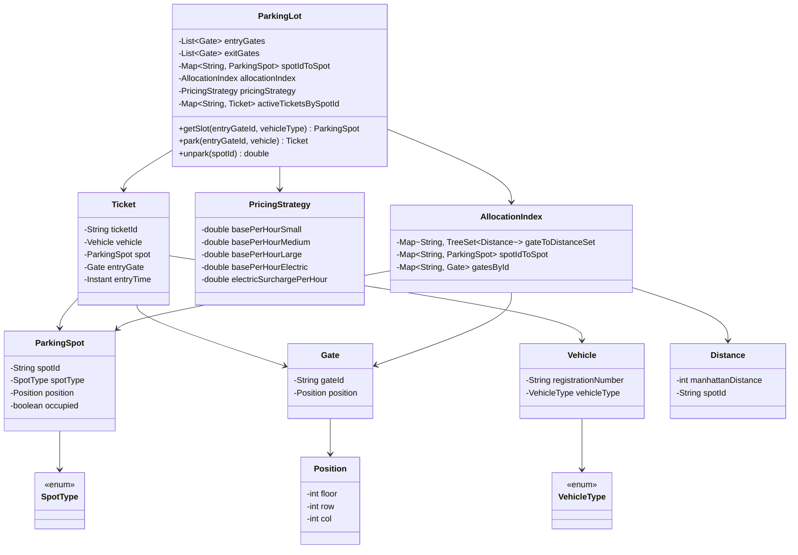

## Parking Lot System

### UML Diagram (Mermaid)

```mermaid
classDiagram
    class VehicleType {<<enum>>}
    class SpotType {<<enum>>}

    class Position {
      -int floor
      -int row
      -int col
    }

    class Gate {
      -String gateId
      -Position position
    }

    class ParkingSpot {
      -String spotId
      -SpotType spotType
      -Position position
      -boolean occupied
    }

    class Vehicle {
      -String registrationNumber
      -VehicleType vehicleType
    }

    class Ticket {
      -String ticketId
      -Vehicle vehicle
      -ParkingSpot spot
      -Gate entryGate
      -Instant entryTime
    }

    class PricingStrategy {
      -double basePerHourSmall
      -double basePerHourMedium
      -double basePerHourLarge
      -double basePerHourElectric
      -double electricSurchargePerHour
    }

    class AllocationIndex {
      -Map~String, TreeSet~Distance~~ gateToDistanceSet
      -Map~String, ParkingSpot~ spotIdToSpot
      -Map~String, Gate~ gatesById
    }

    class Distance {
      -int manhattanDistance
      -String spotId
    }

    class ParkingLot {
      -List~Gate~ entryGates
      -List~Gate~ exitGates
      -Map~String, ParkingSpot~ spotIdToSpot
      -AllocationIndex allocationIndex
      -PricingStrategy pricingStrategy
      -Map~String, Ticket~ activeTicketsBySpotId
      +getSlot(entryGateId, vehicleType) ParkingSpot
      +park(entryGateId, vehicle) Ticket
      +unpark(spotId) double
    }

    Vehicle --> VehicleType
    ParkingSpot --> SpotType
    Gate --> Position
    Ticket --> Vehicle
    Ticket --> ParkingSpot
    Ticket --> Gate
    AllocationIndex --> Distance
    AllocationIndex --> ParkingSpot
    AllocationIndex --> Gate
    ParkingLot --> AllocationIndex
    ParkingLot --> PricingStrategy
    ParkingLot --> Ticket
```

