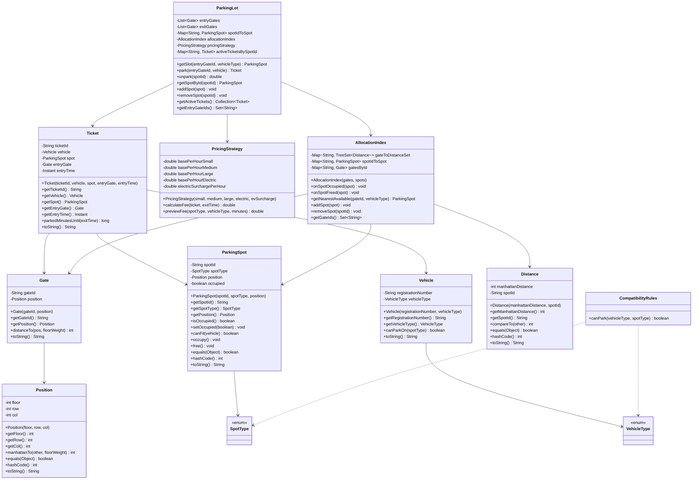

## Parking Lot System

### How to run

1. Compile
```
javac -d bin $(find src -name "*.java")
```
2. Run
```
java -cp bin com.example.parkinglot.App
```

### Key features
- Nearest-slot allocation per entry gate using TreeSet-backed index.
- Multi-floor support via weighted Manhattan distance (floor weight favored).
- Vehicle-to-spot compatibility rules, including electric charging surcharge.

### UML Diagram (Mermaid)




